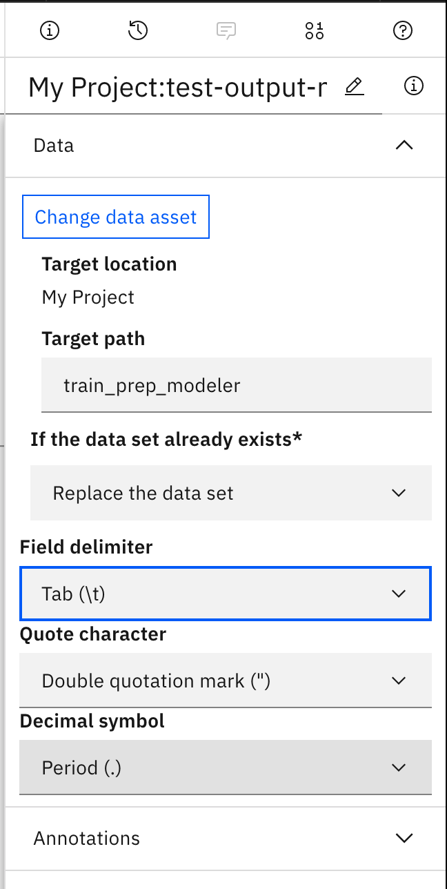

## Data Preparation with SPSS Modeler

In this exercise, we will create a _SPSS Modeler_ flow to analyze and prepare data.

## Getting Started

- Access your project
- Click _Add to project_

- Choose _Modeler flow_ as asset type

- Create a new modeler flow from scratch (use settings as below)

- Walk through the tour or cancel it

- Drag and drop a _Data Asset_ node to the stream canvas

- Double-click on the node and select _Change data asset_

- Choose the data asset

- To check data, right clock on the node and select _Preview_

- A preview of the first rows is displayed

## Prepare Data
- Remove duplicates with the _Distinct_ node from the _Record Operations_ pane\

- Make sure to link the _Data Asset_ and _Distinct_ nodes. There are two ways to do so: 1. Click on the _Data Asset_ node and then double-click on _Distinct_ in the _Record Operations_ pane. 2. Drag-and-drop a _Distinct_ node to the canvas, hover over the _Data Asset_ node until you see a blue arrow, draw this arrow to the _Distinct_ node. The result should look like this: \

- Double-click on _Distinct_ and choose "Include only the first record" \

- Add a _Data Audit_ node from the _Output_ pane. Don't forget to link it to the _Distinct_ node. Double click on node, select "use custom fields" and add all columns except PassengerId, Name, Ticket, RecordCount. Save your changes. Your canvas should look similar to this: \

- Right click on node and select _Run_. The result is automatically displayed. If not or if you want to retrieve this output later, click here:\

- You will see that there are missing values for _Age_, _Cabin_ and _Embarked_. 
- Discard the records where _Age_ is missing: From the _Record Operations_ pane, add a _Select_ node after the _Distinct_ node (re-arrange nodes if necessary) : \

- Double click on the _Select_ node, select _Discard_ and type the condition as seen below (Please note: you could also click on the small calculator and build the condition or even more complex ones here). Save your changes\

- From the _Field Operations_ pane, add a _Filter_ node after the _Select_ node. Double click on the node, and filter, i.e. remove,  _Cabin_\

- From the _Field Operations_ pane, add a _Filler_ node after the _Filter_ node. Double click on the node, add column _Embarked_ and replace null values with 'S', the most frequent value: \

- Finally, export the result to a new csv file. From the _Export_ pane, add a _Data Asset Export_ node after the _Filler_ node\

- Your resulting data stream will look similar to this: \

- Right click on the _Data Asset Export_ node and select _Run_ to write the csv file to your project data assets. 
