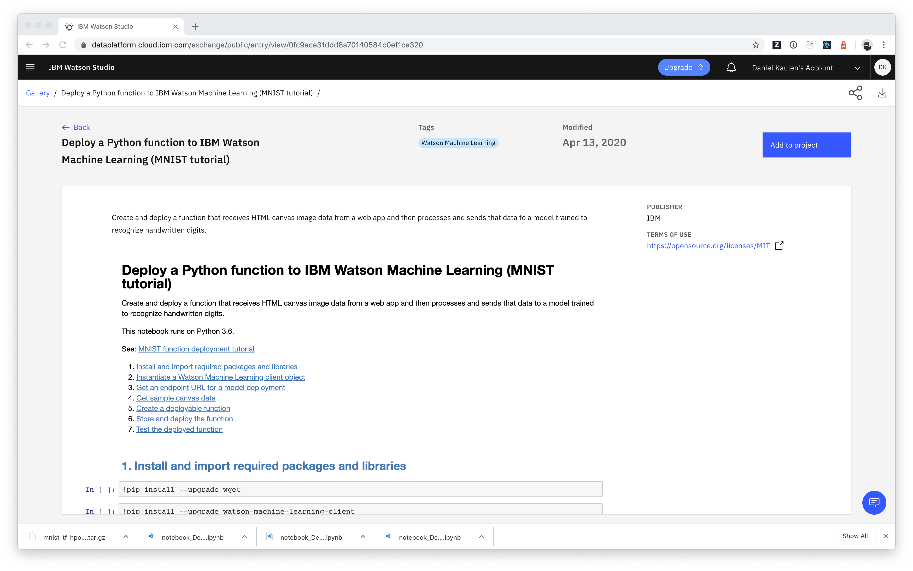
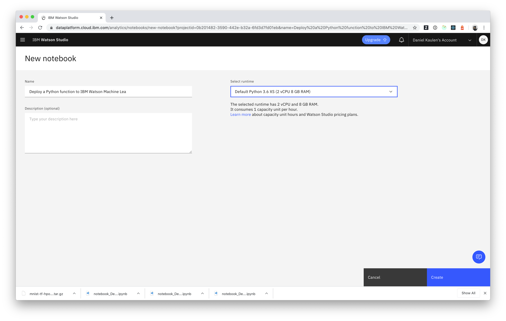

## TensorFlow Model Deployment

In this exercise you will learn how to deploy a TensorFlow Model with the aid of the [Machine Learning](https://cloud.ibm.com/catalog/services/machine-learning) service on IBM cloud.  You will follow steps from a public sample notebook to deploy a prebuilt model for the [MNIST data set](https://en.wikipedia.org/wiki/MNIST_database).

### Prerequisites
- Basic experience with [Watson Studio](https://dataplatform.cloud.ibm.com) and model deployment

### Instructions
- Open the link to the sample notebook from the gallery at https://dataplatform.cloud.ibm.com/exchange/public/entry/view/0fc9ace31ddd8a70140584c0ef1ce320
  - make sure to update the link depending on the region of your Watson Studio instance, e.g. use https://eu-de.dataplatform.cloud.ibm.com/exchange/public/entry/view/0fc9ace31ddd8a70140584c0ef1ce320 for Frankfurt.
  - if the link does not work: you find a copy of all required resources in the [data](./data) folder

- Click Add to project and select the project to add the notebook to
- Click Create on the New notebook page (the smallest default python runtime available is sufficient)

- Follow the instructions of the **first three** steps in the notebook
  - for Step 1:  _Install and import required packages and libraries_
  - for Step 2: _Instantiate a Watson Machine Learning client object_
  - for Step 3.2: _Get an endpoint URL for a model deployment (Option 2: Download, store, and deploy a sample model)_ 
- Note the endpoint URL of the model deployment

You will make use of the deployed model in the [Node Red](../node-red/) exercise.
