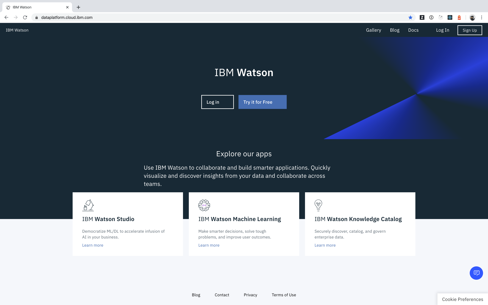

## How can I access Watson Studio?

## Regions
_Watson Studio_ is hosted in four different regions
  - Dallas: https://dataplatform.cloud.ibm.com/
  - Frankfurt: https://eu-de.dataplatform.cloud.ibm.com/
  - London: https://eu-gb.dataplatform.cloud.ibm.com/
  - Tokyo: https://jp-tok.dataplatform.cloud.ibm.com/

Use the geographically closest region to work on your exercises.

## Login / Registration
On the home page, you can either _Log in_ with your existing credentials, or provision a new instance by selecting _Try it for Free_.

