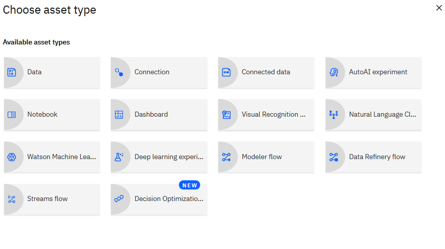
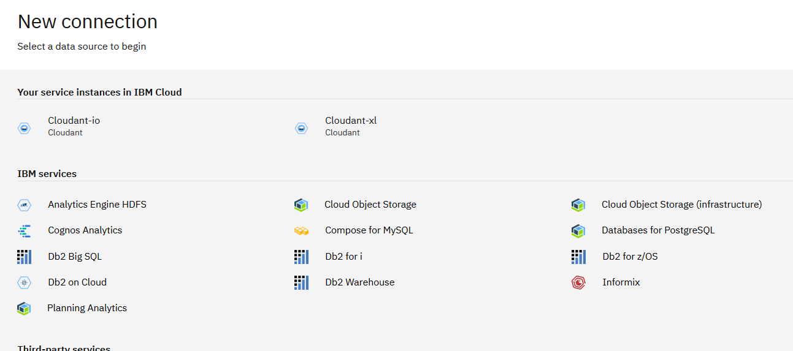
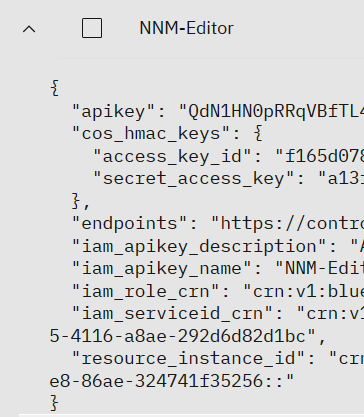
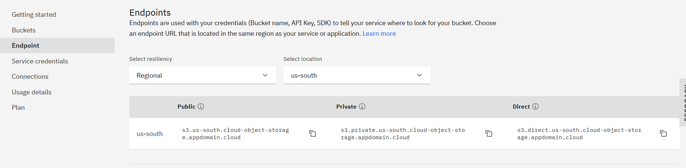
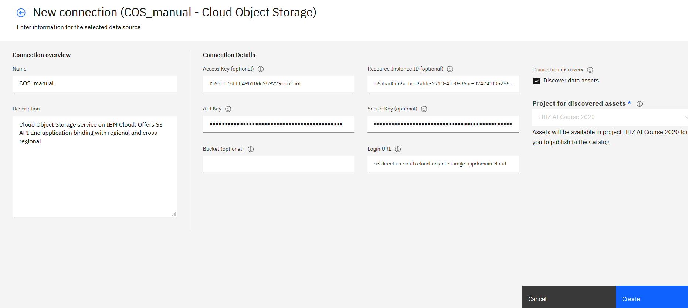
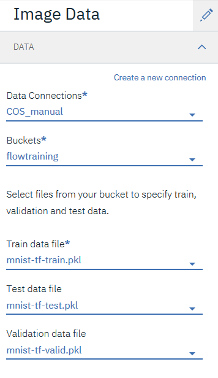

## How to solve the error "There are no files in this bucket" in the Neural Network Modeler tutorial? 

_This question regards the optional exercise "Neural Network Modeler"_. 

We received an error "There are no files in this bucket", when following the tutorial at Step 2, 4. d - even though the files were in the bucket. (Side note: Neural Network Modeler is in beta mode) 

If you also receive this error, here is a workaround that worked for us - manually adding the COS connection to the project. 

In Watson Studio: 
- _Add to project_ --> _Connection_ \

- Choose _Cloud Object Storage_ (not: _Cloud Object Storage (infrastructure)_!) \

In a separate window/tab in your browser, open your Cloud Object Storage (subsequently abbreviated COS, this is the place where you created the buckets): 
- Click on _Service credentials_ on the left side and you will find a key with the name "NNM-Editor" or similar:\

- Here, you have information you need for the COS _Connection details_ in your Watson Studio project.
Copy and paste these values (always without "") : 

 - "apikey" --> _API Key_ 
 - "access_key_id" --> _Access Key_  
 - "secret_access_key" --> _Secret Key_ 
 - "resource_instance_id" --> _Resource Instance ID_ 

Return to the COS window/tab in your browser, click on _Endpoints_ on the left side, _Select resiliency_: Regional and _Select location_: us-south, and copy the _Direct URL_.\

- Paste this URL as _Login URL_. The resulting settings should look like this (of course with your keys and IDs!) - click on _Create_\

- Now, you can go back to the _Neural Network Modeler_ and continue with the tutorial at Step 2, 4 e. 

