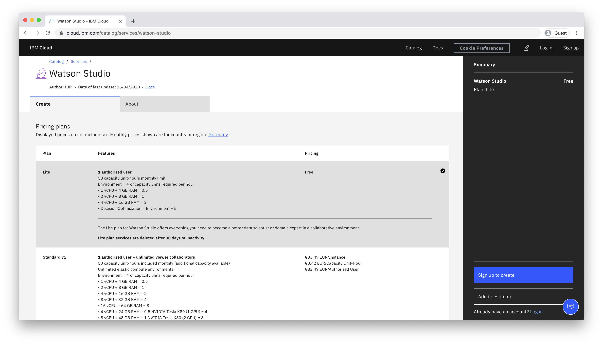

# How long can I use Watson Studio for free?

If you sign up for a "Lite" plan, you will get a free compute environment and a monthly limit of 50 capacity-unit hours.

To learn more about compute usage, visit https://dataplatform.cloud.ibm.com/docs/content/wsj/analyze-data/track-runtime-usage.html.

To check the remaining Capacity Unit Hours (CUH), open the _Environments_ tab of your project

