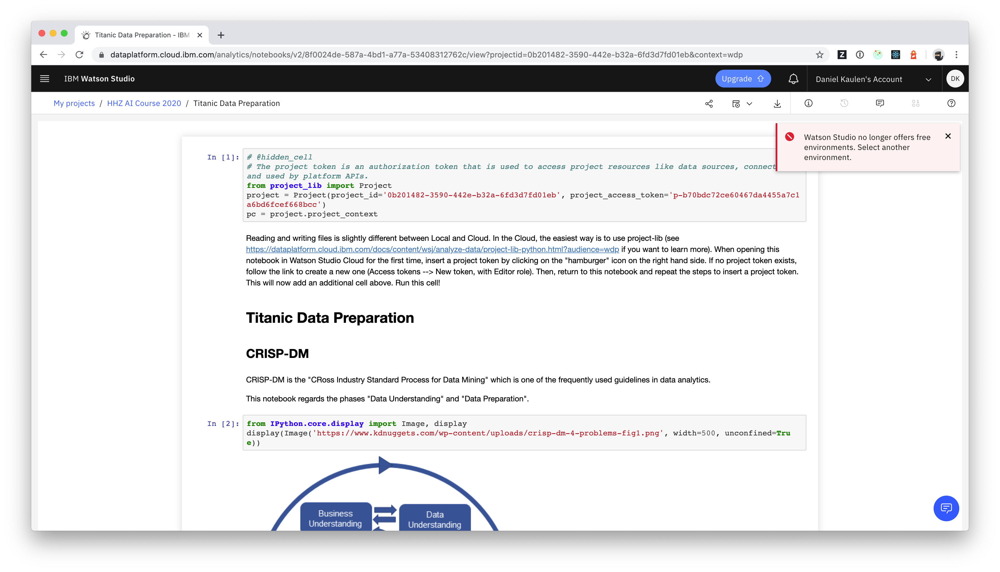
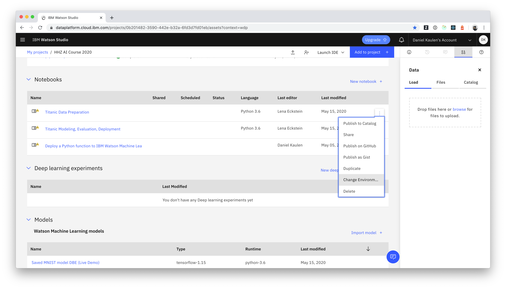
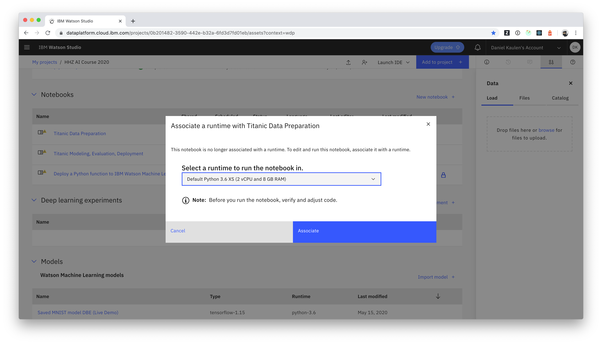
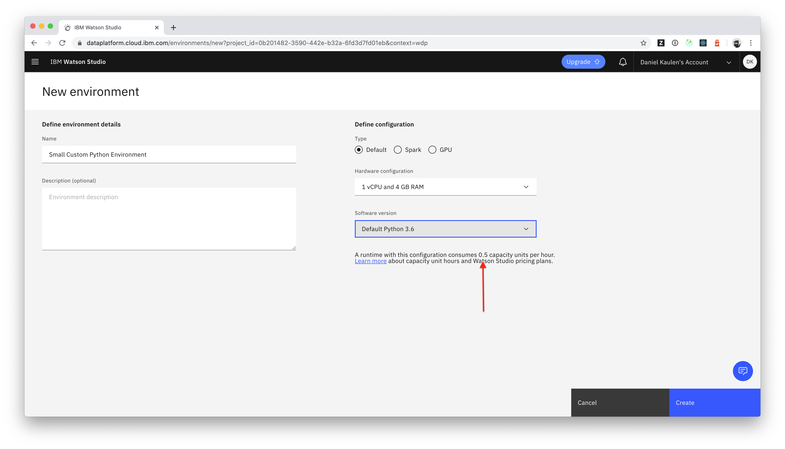

# When I open a notebook an error is shown that indicates that Watson Studio no longer offers free environments. What should I do?

Starting on May 19, 2020, Watson Studio pricing plans have changed. Please check the following links for details.
  - https://www.ibm.com/cloud/blog/announcements/watson-studio-plan-updates
  - https://dataplatform.cloud.ibm.com/docs/content/wsj/getting-started/whats-new.html?audience=wdp&context=wdp

If you open a notebook that you previously started with a free runtime, an error will be shown in the UI:

In order to change the runtime, you need to follow the instructions from the official [documentation](https://dataplatform.cloud.ibm.com/docs/content/wsj/analyze-data/change-environment.html?audience=wdp&context=wdp&linkInPage=true):

Afterwards you can continue to use the environment until your monthly limit of capacity unit hours is reached (see [free usage instructions](../capacity-unit-hours) for more details).

### Tip
The smallest default python runtime (2 vCPU and 8 GB RAM) consumes 1 capacity unit per hour. You can create a custom environment definition with a smaller size that only consumes 0.5 capacity units per hour:
- Switch to the environments tab
- Click "New environment definition"  

- Click "Create"

Afterwards you can associate existing notebooks with this environment (or create new notebooks based on this environment).
