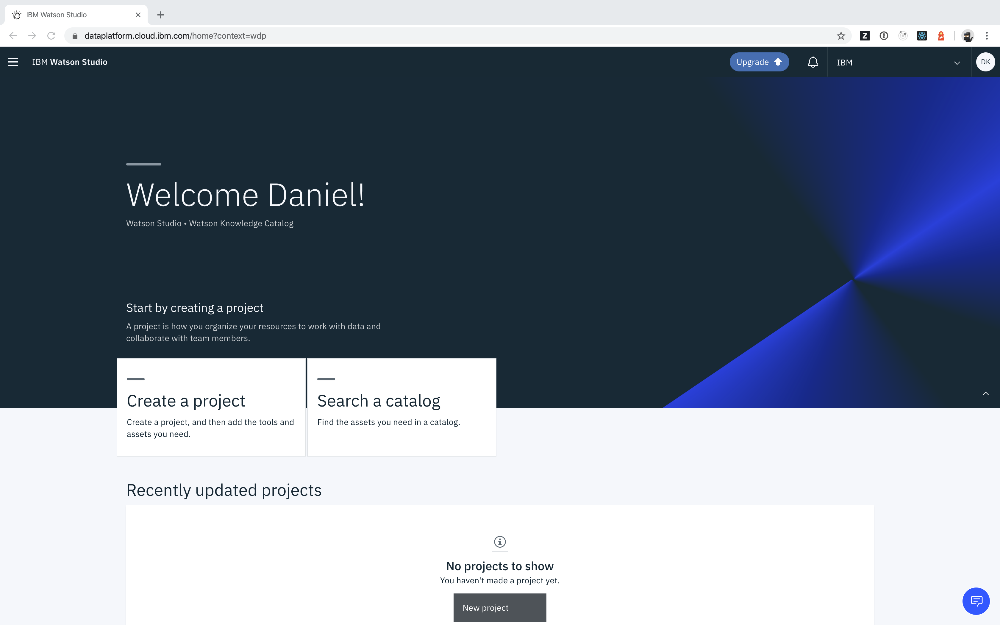
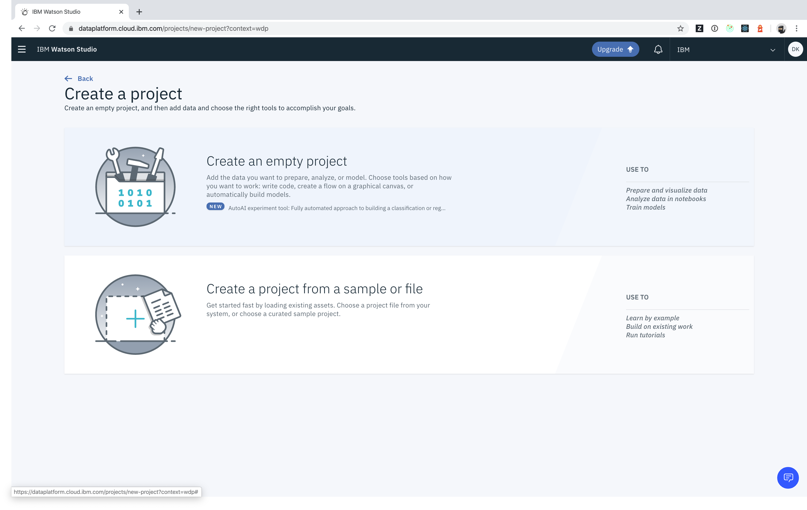
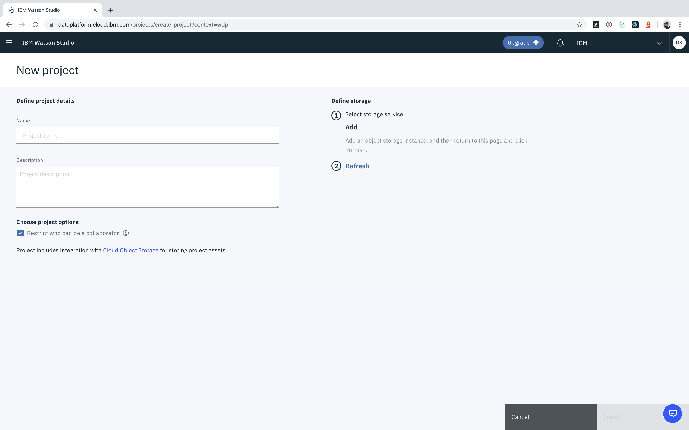
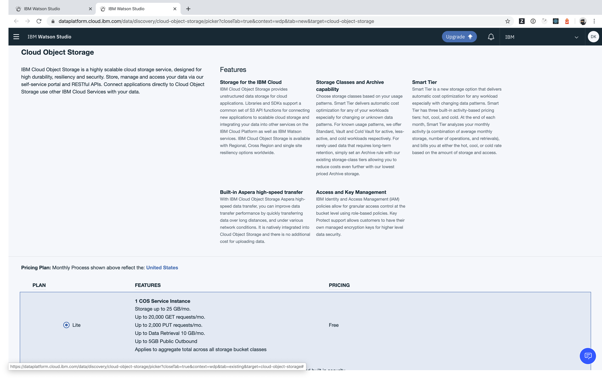
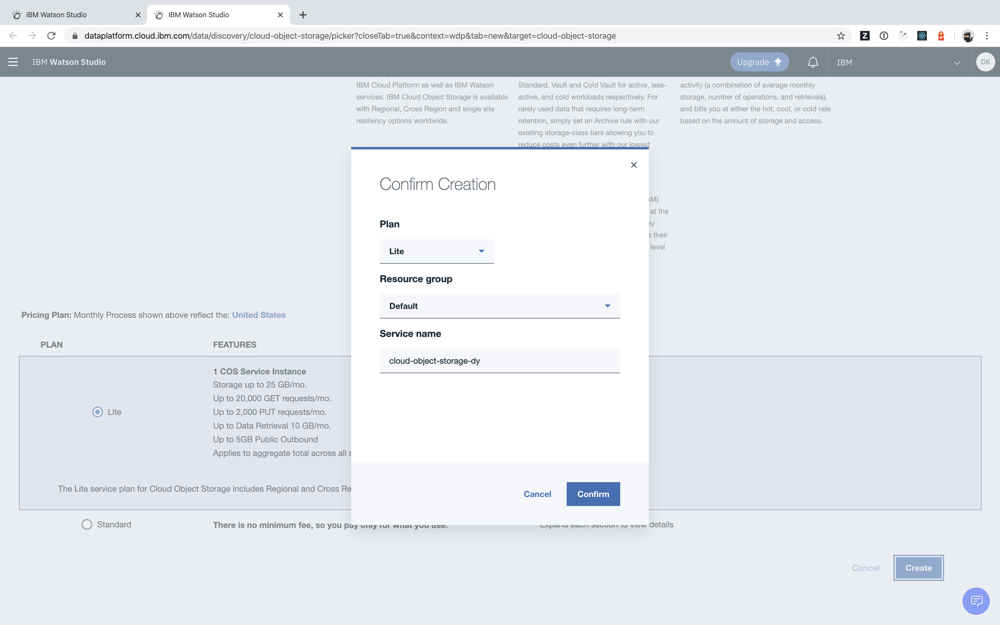
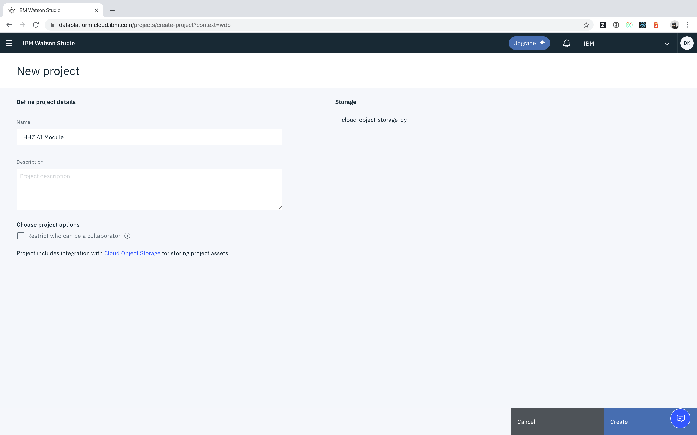
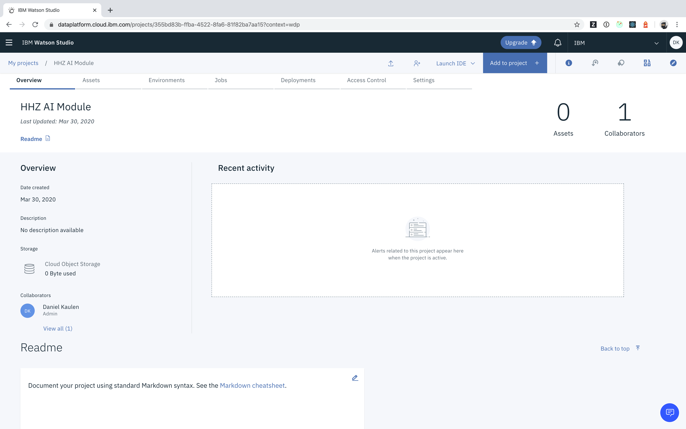

## How can I create a new project?
- Log in to your account
- Select _Create a project_

- Select _Create an empty project_

- (optional) If you see the _Define storage_ section on the right, click _Add_ to link your project with a storage instance

- (optional) Create a new Cloud Object Storage instance

- Specify project name and description

- Click _Create_ to create the project

