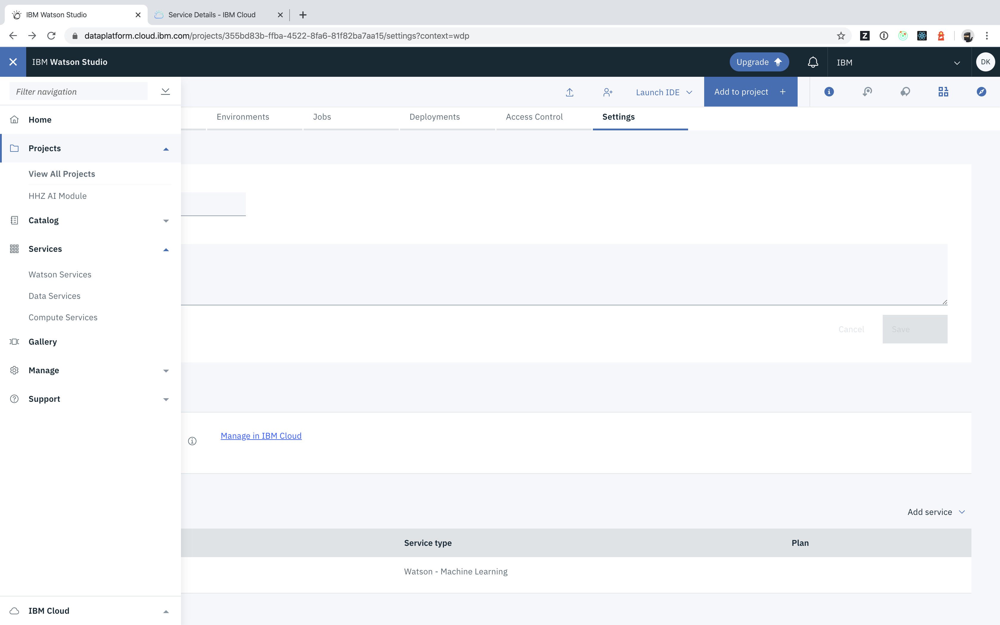
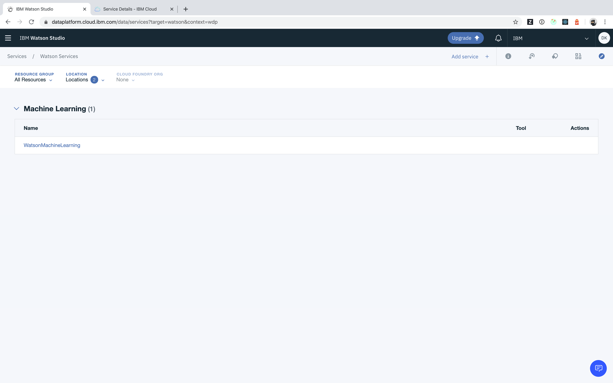
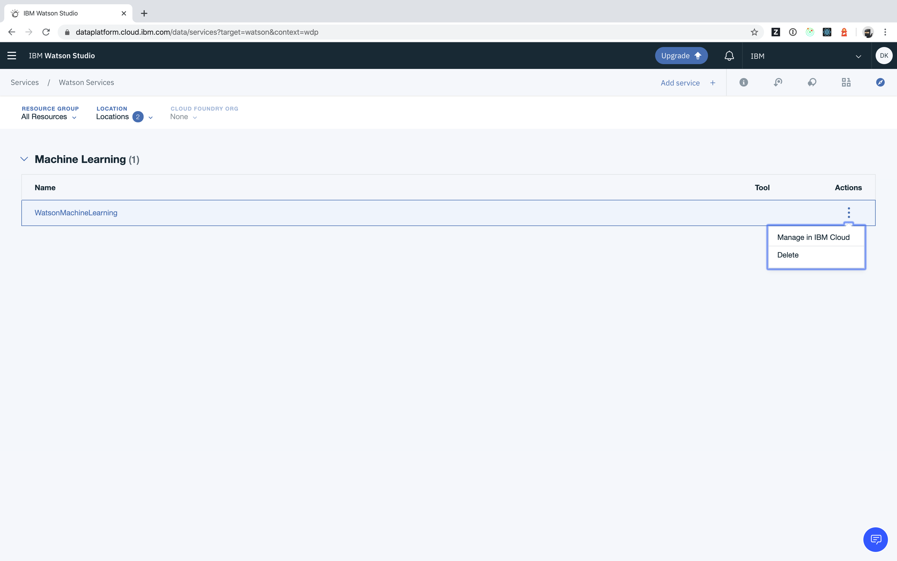
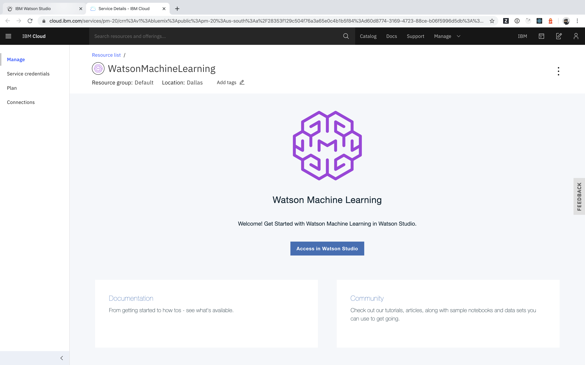
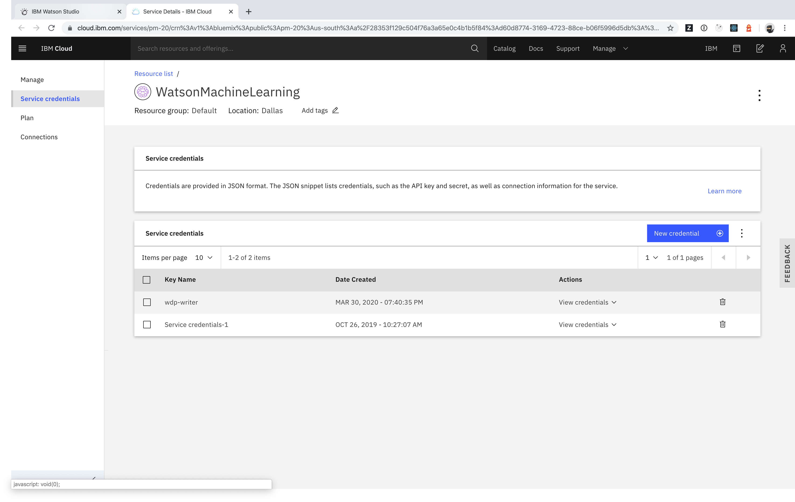
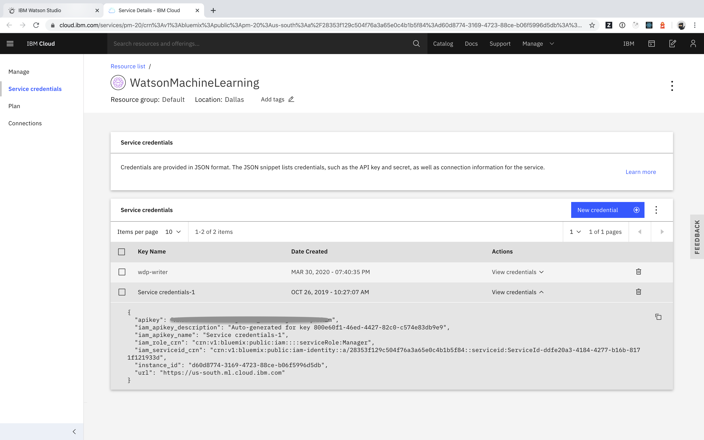

## How can I review service credentials of a linked Watson Service?

- Access Watson Studio
- Open the left navigation menu

- Identify the _Watson_ service to create/get credentials for

- Click _Manage in IBM Cloud_

- Switch to _Service credentials_

- Create _New credentials_ or reuse one of the existing service credentials

- Click _View Details_ and copy the displayed information

These credentials can be used to programmatically access your _Watson_ service (e.g. from within notebooks).
