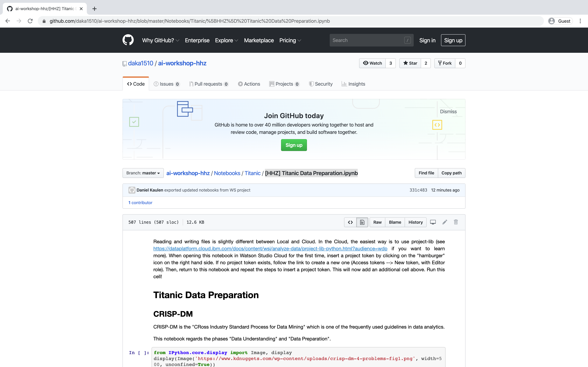
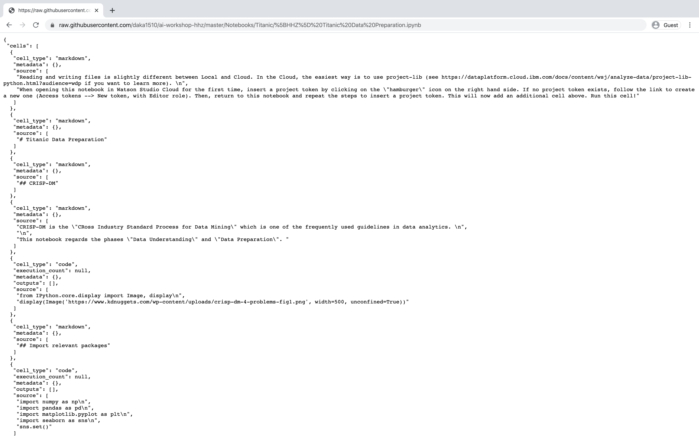

# How can I download files from Github?

To download the entire repository content as ZIP file
- access the repository URL (e.g. https://github.com/daka1510/ai-workshop-hhz)
- Click _Clone or download_ and select _Download ZIP_

To download individual files
- Navigate to the file you need (e.g. [[HHZ] Titanic Data Preparation.ipynb](https://github.com/daka1510/ai-workshop-hhz/blob/master/Notebooks/Titanic/%5BHHZ%5D%20Titanic%20Data%20Preparation.ipynb))
- Select _Raw_

- Save the raw content of the file via your browser (e.g. Right click -> Save as). Make sure that the file suffix of the saved file matches the file suffix in Github (here: `.ipynb`).

