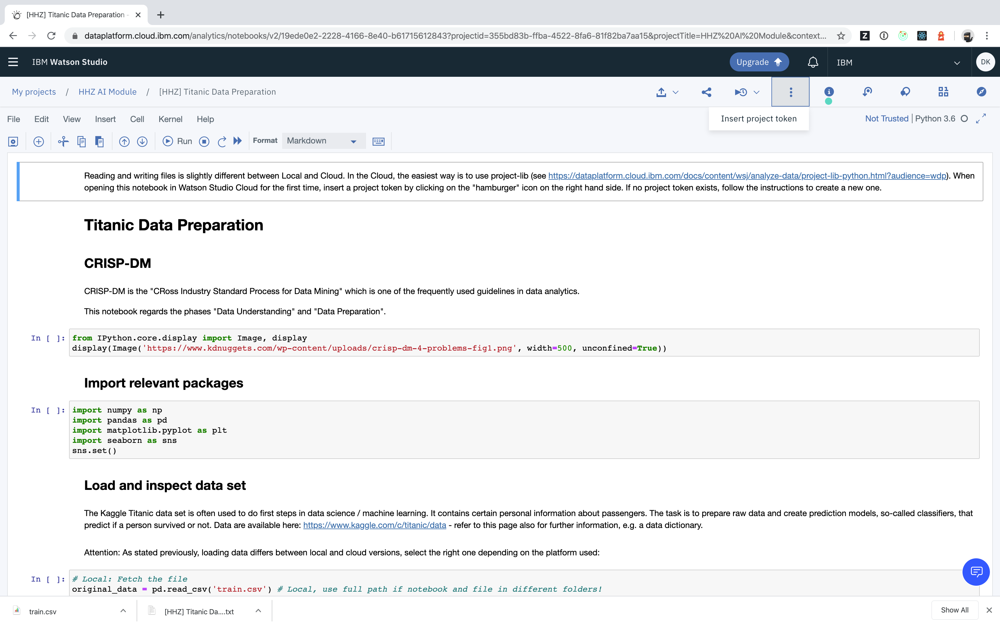
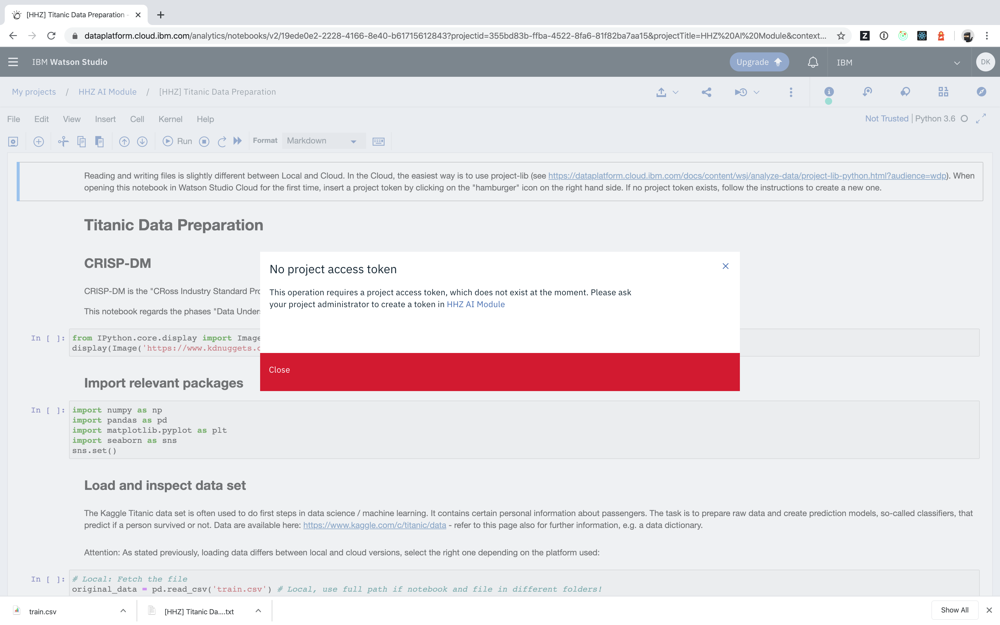
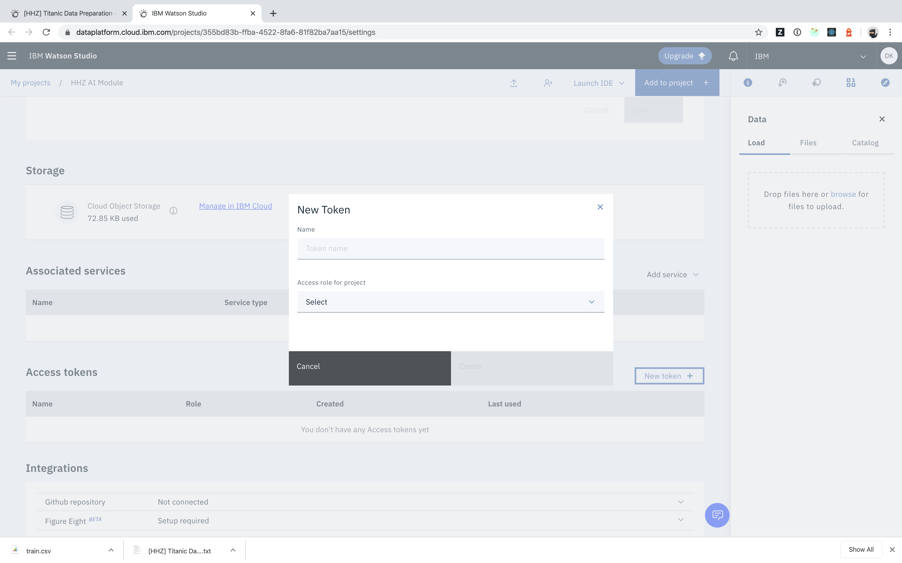
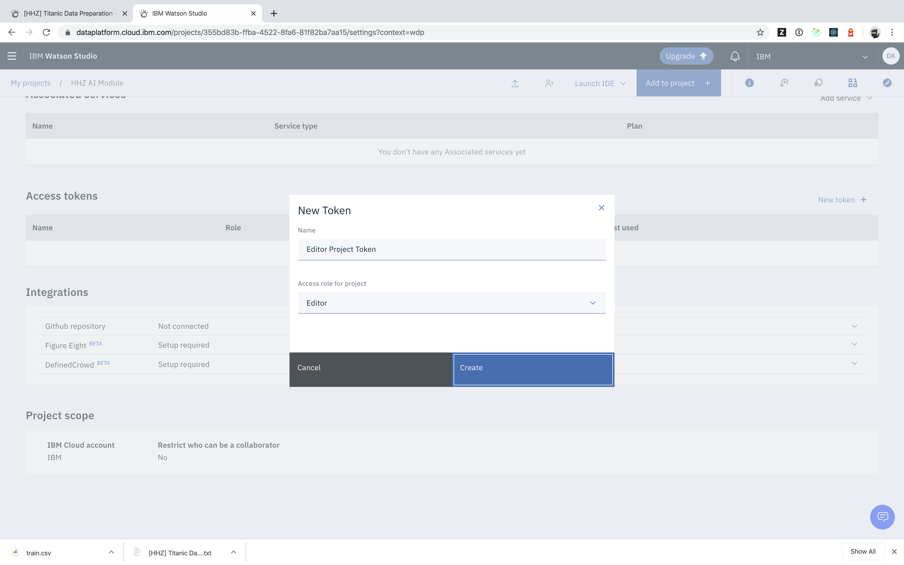
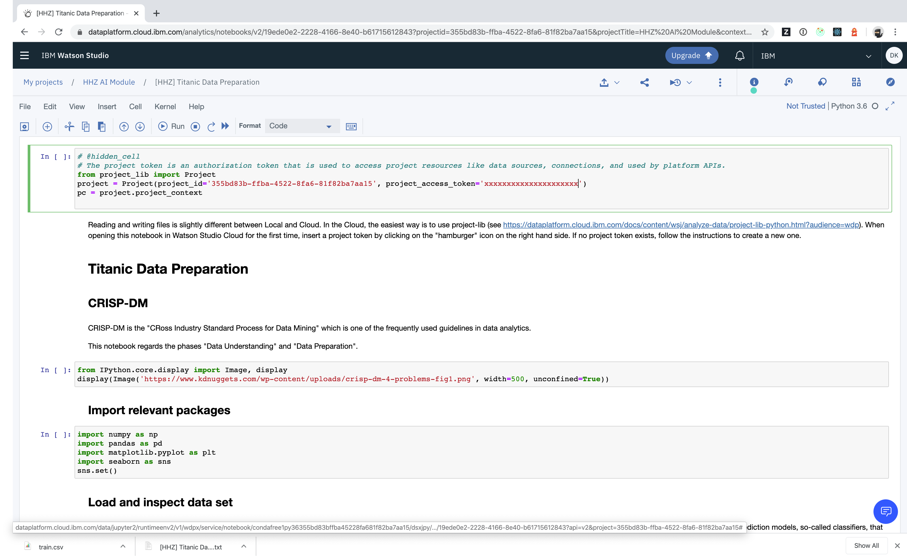

## How can I add a project token to my notebook?

- Open your notebook in edit mode
- Click on the three vertical dots and select insert project token

- If no project token is set, follow the link to create a new project token

- Scroll down on the project settings page and click _New token_

- Enter token details in the modal dialog (select Editor rights to ensure you can create and read files in your project)

- Go back to your project, and select "Insert project token" again

- Run the first cell that was inserted to your notebook

For more details about the project library that requires this token, please refer to the official [documentation](https://dataplatform.cloud.ibm.com/docs/content/wsj/analyze-data/project-lib-python.html?audience=wdp)
