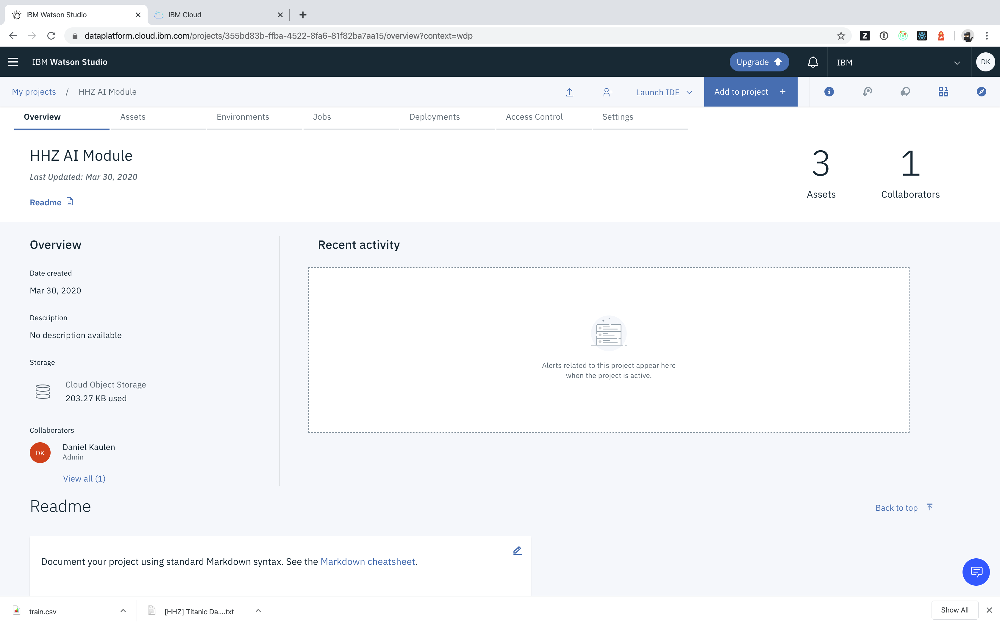
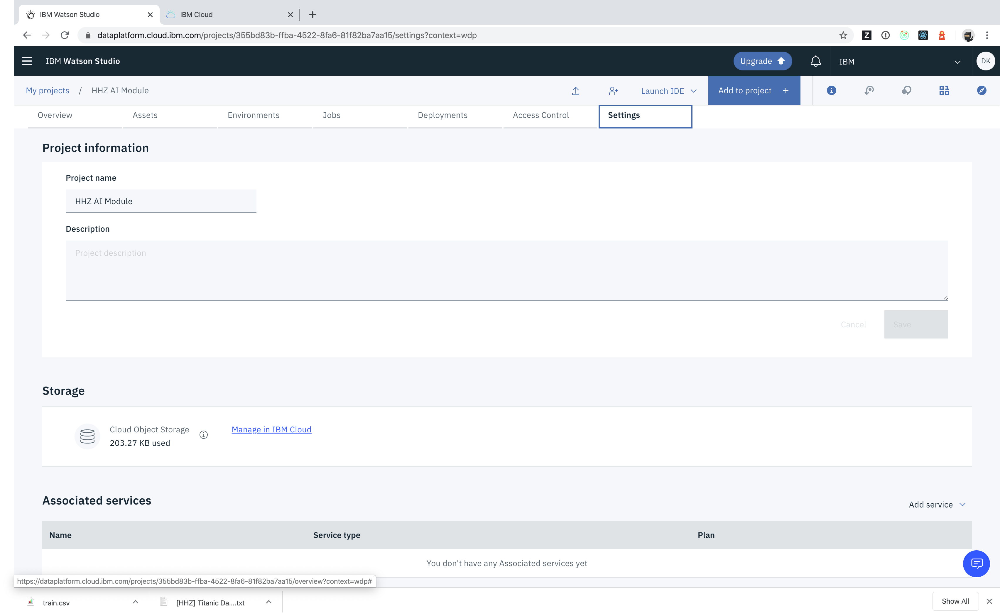
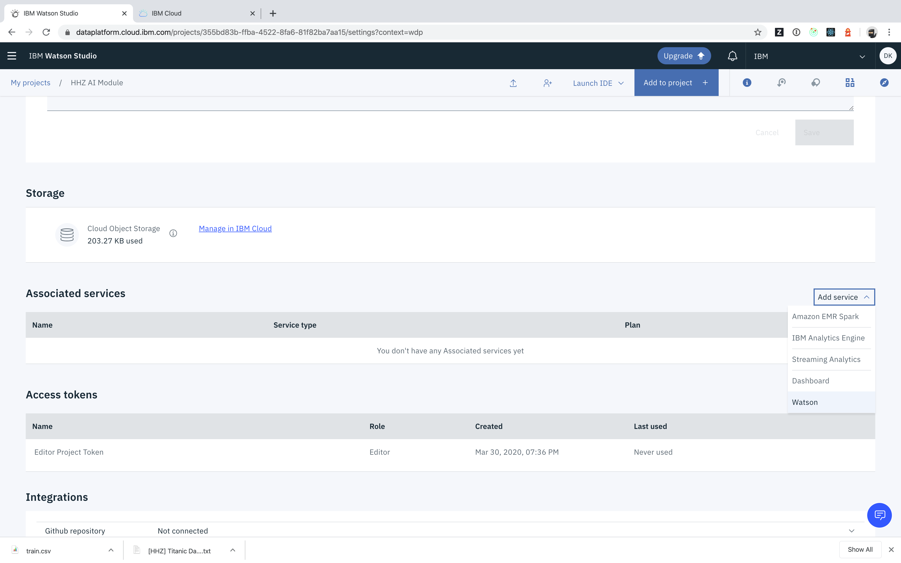
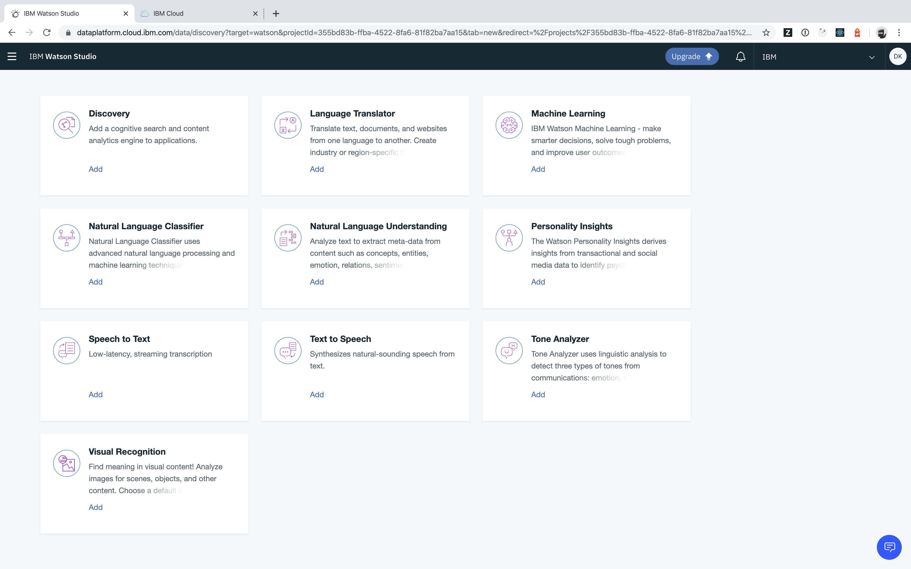
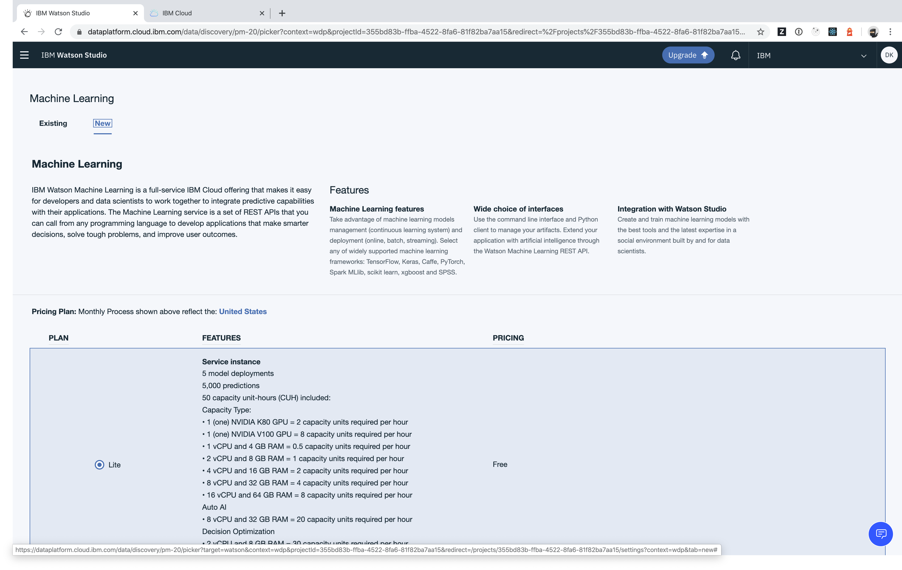
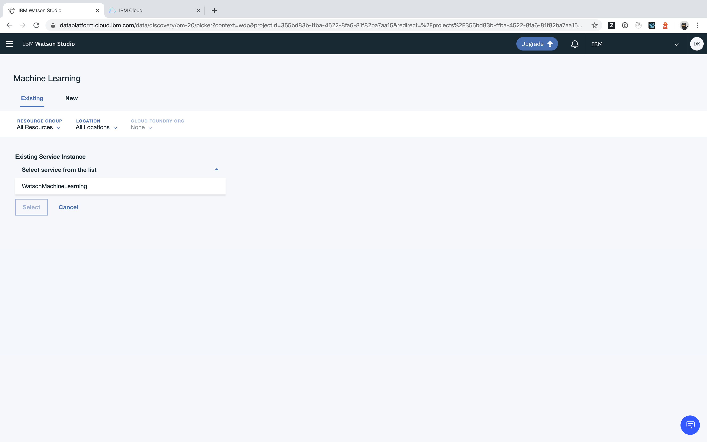
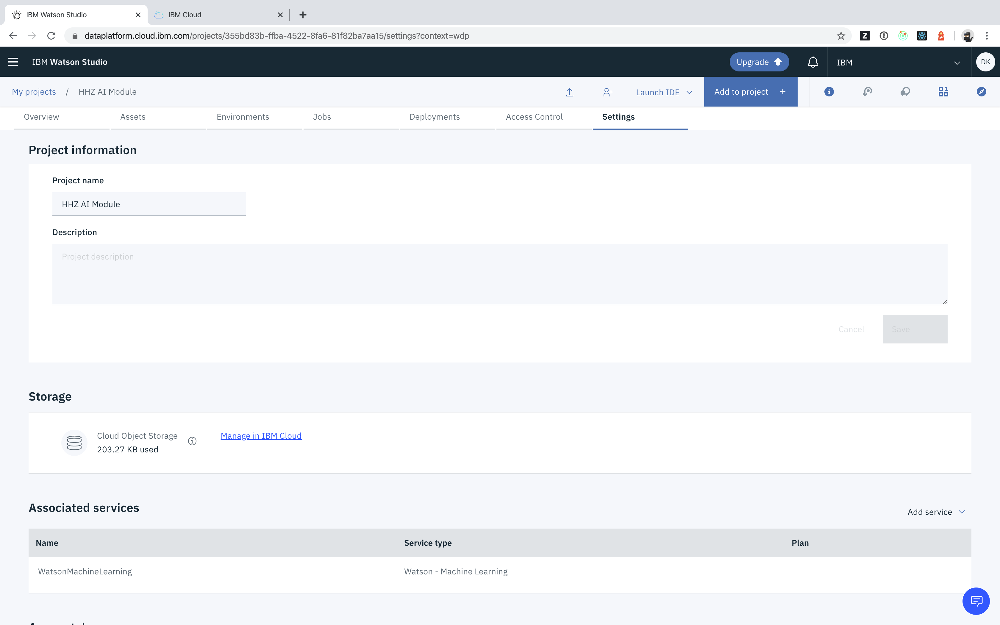

## How can I link my project with a Watson Service?

- Access your project

- Switch to the _Settings_ tab

- Select _Add service_ and choose _Watson_

- Choose a service to link with your project, e.g. _Watson Machine Learning_

- Create a new instance or select an existing instance

- Go back to the project _Settings_ view and review the list of _Associated services_

If you, for example, link a Watson Machine Learning instance with your project, you can use the _Deployments_ tab to review and edit deployments managed by the associated service.
