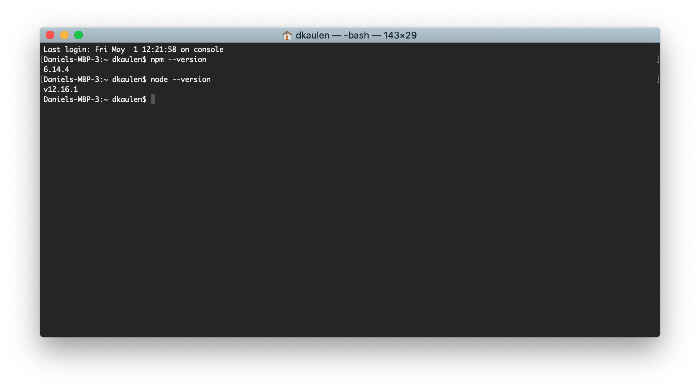
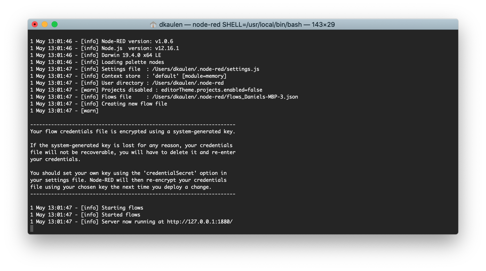
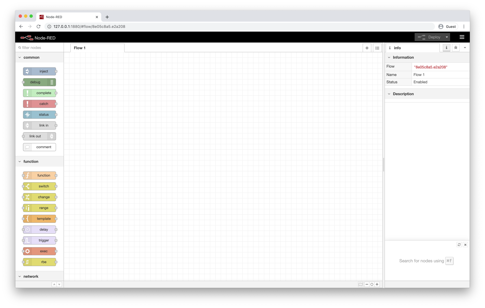

## How can I start Node-RED on my local workstation?

This documentation only supplements the official documentation that explains different options to run Node-RED locally (https://nodered.org/docs/getting-started/local).

### Installing with npm
- Install the Node.JS runtime (https://nodejs.org/en/)
- Verify your installation by checking if the `npm --version` and `node --version` commands succeed

- Install Node-RED as outlined in the documentation ([Mac/Linux](https://nodered.org/docs/getting-started/local#installing-with-npm), [Windows](https://nodered.org/docs/getting-started/windows))
- Start Node-RED by running `node-red`

- Open Node-RED at http://127.0.0.1:1880/

Happy prototyping. 

For other deployment options see also https://nodered.org/docs/getting-started/. To expose your local server to the public internet, check out https://ngrok.com/ (use at your own risk).

