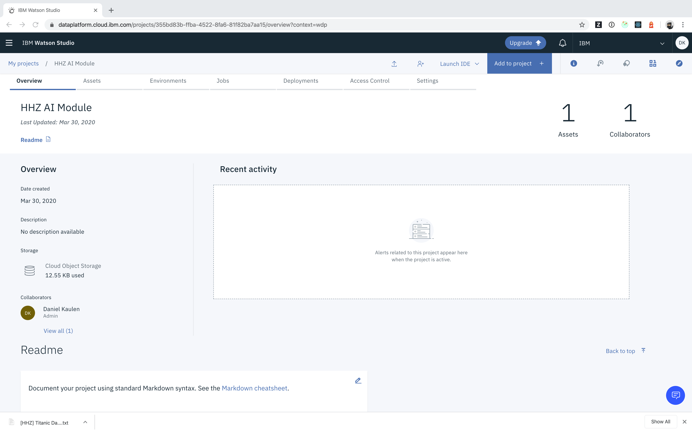
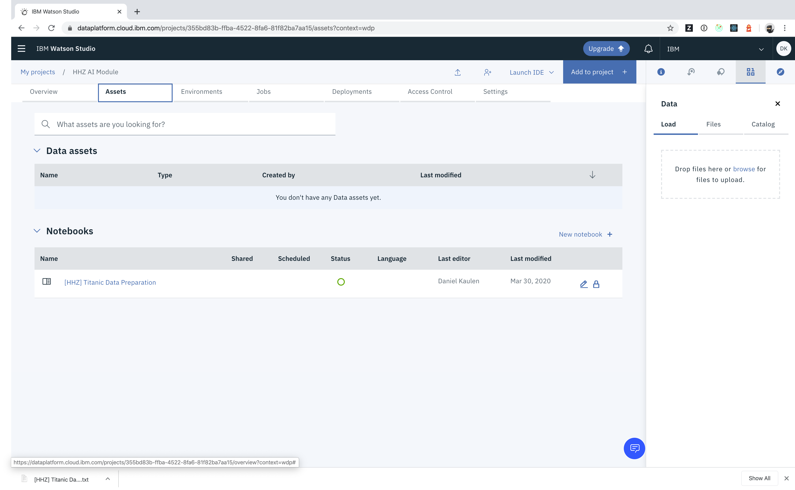
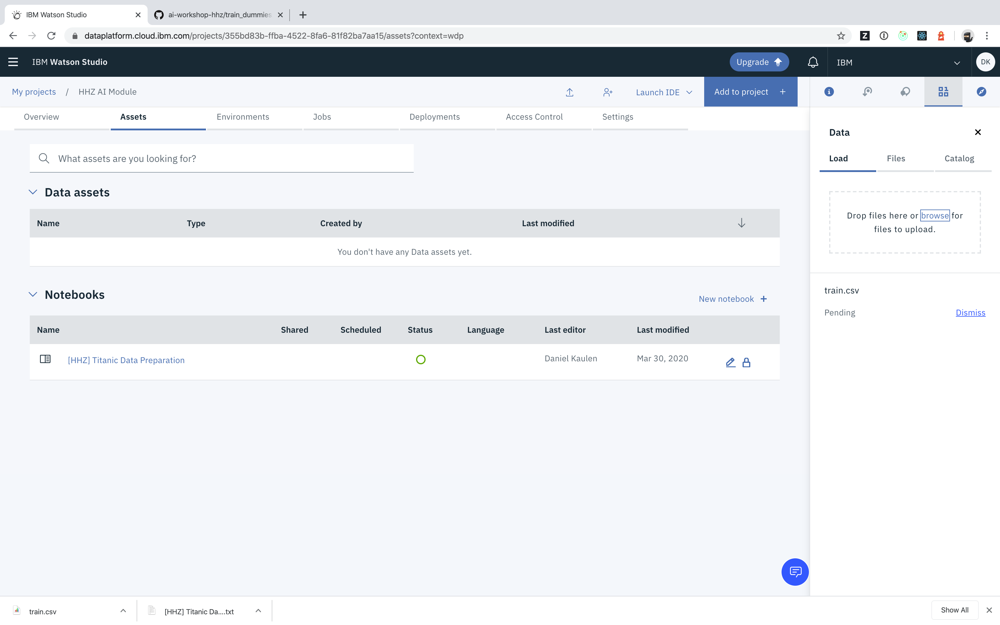
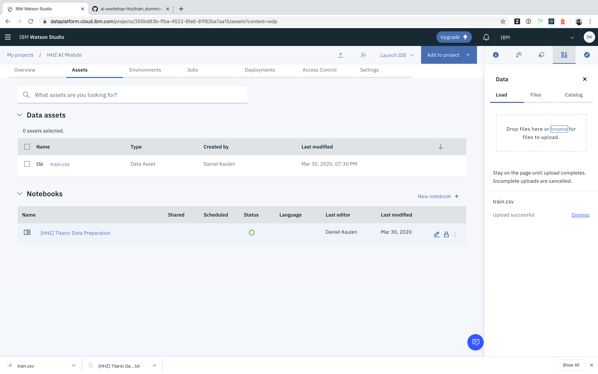

# How can I upload data assets to my project?

- Access your project

- Switch to the _Assets_ tab

- Drop files in the drop zone, or click browse to upload

- The uploaded file appears in the _Data assets_ section

